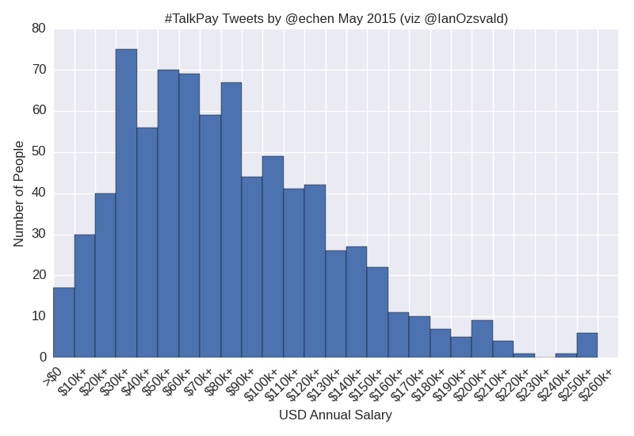
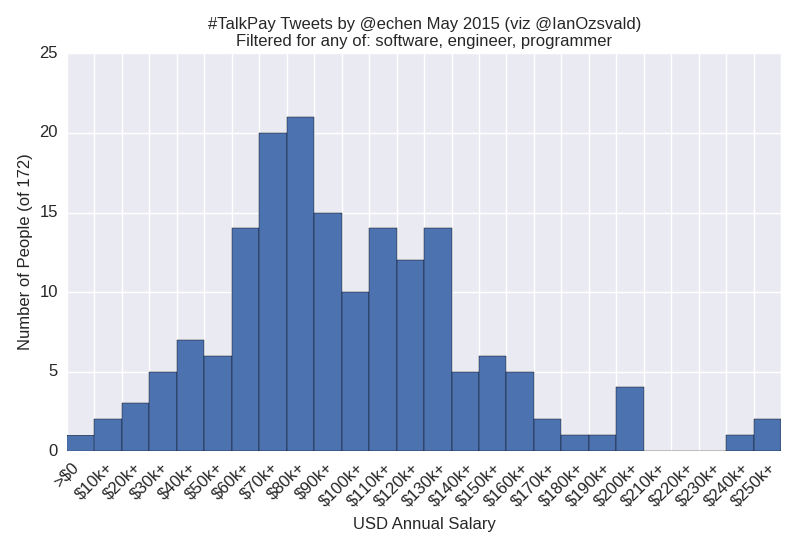
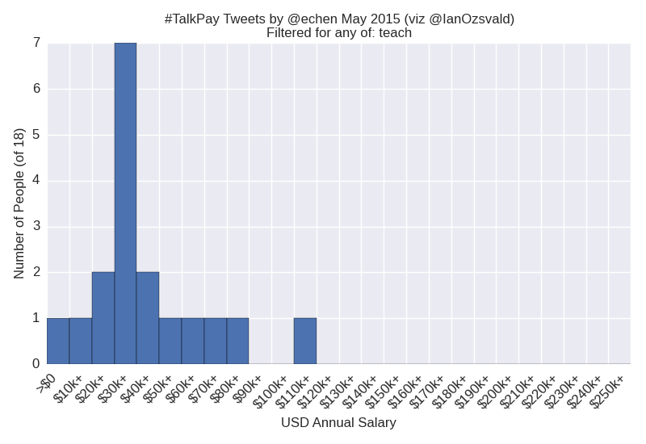
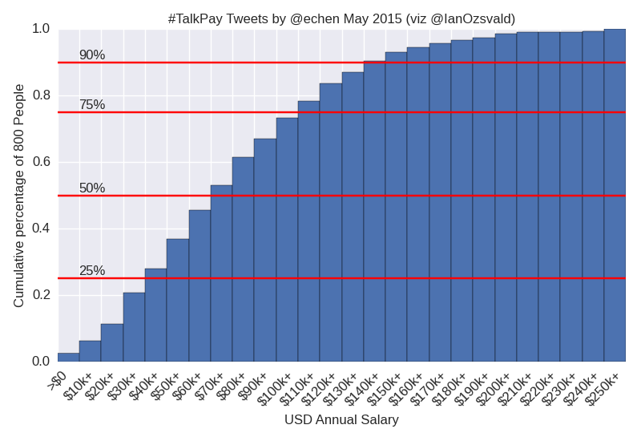

Visualisation of @echen's #talkpay tweet/pay data scrape. Data from: 

* https://twitter.com/echen/status/594353863374737409?s=03
* https://docs.google.com/spreadsheets/d/1IK1an_x8buIveByENsAk6eww-mHIfZeYQxr7FBWPWz8/edit#gid=0
* https://docs.google.com/spreadsheets/d/1IK1an_x8buIveByENsAk6eww-mHIfZeYQxr7FBWPWz8/htmlview?sle=true # not editable

Run `analysis1.py` (note `normed` and `text_filters`), it'll generate an image and save it to a png.

Here are all the salaries:

#

Using `text_filters` we can filter for e.g. software engineers, note the double-peaks around $80k and $120k, then small peaks at $150k, $200k and $250k:

#

Here's a filter for anyone mentioning "teach":

#

A cumulative normed plot gives us an idea of the percentage of people up to a certain salary, this is for everyone:

#

Criticisms:

* Text filtering has no context at all
* There's no historical information for tweets with multiple salaries
* Not enough data - maybe someone could scrape some more?
